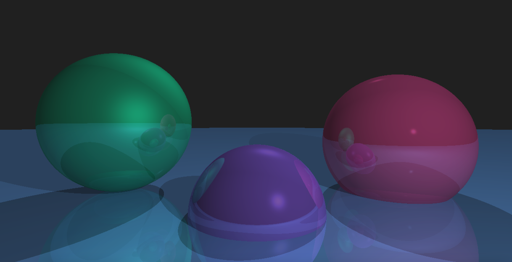

# BASIC Raytracing

3D rendering in BASIC, because why not! Renders a basic scene with spheres through a camera. Supports different types of lights (ambient, point, directional), shadows and recursive reflections. Technique following the book [Computer Graphics from Scratch](https://nostarch.com/computer-graphics-scratch) by [Gabriel Gambretta](https://github.com/ggambetta).

## Running

Run this `raytracing.bas` using [QB64](https://qb64.com/), since this uses full RGB coloring.
